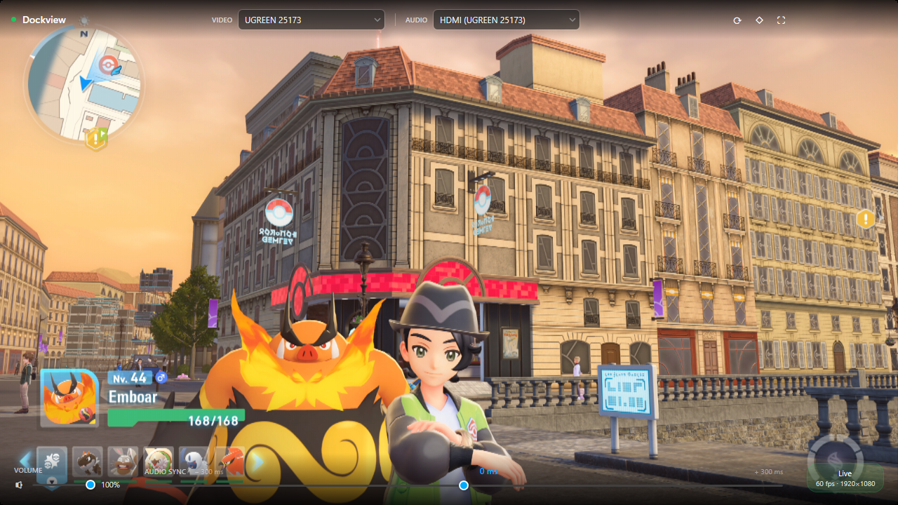

# Dockview

> A minimalist Windows capture card viewer built for the Nintendo Switch — because playing on your PC monitor shouldn't require a streaming setup.



## Why this exists

When the Nintendo Switch 2 launched, I wanted to play on my PC monitor using a USB capture card. Every solution I found was either a full streaming suite (OBS, XSplit) with dozens of features I didn't need, or a basic webcam viewer that couldn't handle HDMI audio.

I didn't want to stream. I didn't want to record. I just wanted a clean, fast window that showed the Switch output — like a TV, but on my PC.

So I built Dockview: a single-purpose viewer that opens instantly, shows the feed at full resolution with low latency, and plays the audio through your speakers. Nothing else.

## Features

- **Live 1080p/60fps** video via Media Foundation SourceReader
- **HDMI audio passthrough** with adjustable sync offset (±300 ms) to fix desync
- **Fullscreen mode** with auto-hiding controls (F11 / Esc)
- **Adaptive render quality** — three presets to match your hardware:
  - ⚡ Performance — NearestNeighbor scaling, 30 fps render cap
  - ◇ Balanced — Linear GPU scaling, 60 fps *(default)*
  - ◈ Quality — Bicubic scaling, 60 fps
- **Auto-detects** capture card video and audio devices on startup
- **Persists settings** between sessions (device selection, volume, audio offset, quality preset)
- Zero installation required — single portable `.exe`

## Requirements

- Windows 10 / 11 (x64)
- A UVC-compatible HDMI capture card (tested with UGREEN 25173)
- The capture source (Nintendo Switch, console, camera — anything with HDMI out)

## Download

Grab the latest `Dockview.exe` from the [Releases](../../releases) page. No installer, no setup — just run it.

## Building from source

**Prerequisites:** .NET 8 SDK, Visual Studio 2022 or VS Code with C# Dev Kit.

```bash
git clone https://github.com/your-username/dockview.git
cd dockview
dotnet run
```

**Release build (single portable EXE):**

```bash
dotnet publish -c Release -p:PublishSingleFile=true -p:IncludeNativeLibrariesForSelfExtract=true
```

Output: `bin/x64/Release/net8.0-windows/win-x64/publish/Dockview.exe`

## Technical notes

Dockview avoids the usual .NET WPF capture card pitfalls:

- **Raw COM vtable dispatch** — instead of `[ComImport]` interfaces (which trigger a `QueryInterface` that fails on in-process MF objects in .NET 8), every Media Foundation call goes through direct vtable function pointers via `delegate* unmanaged[Stdcall]`. No RCW, no QI, no `E_NOINTERFACE`.
- **MTA threading** — Media Foundation requires MTA threads. WPF's UI thread is STA. All MF operations run on dedicated background threads.
- **ArrayPool frame buffers** — raw frames (~8 MB at 1080p) are rented from `ArrayPool<byte>` and returned after rendering, avoiding Large Object Heap allocations and Gen2 GC pauses.
- **VSync-synced rendering** — `CompositionTarget.Rendering` fires once per display refresh on the UI thread. The capture thread only keeps the latest frame; the renderer picks it up at VSync. No `InvokeAsync` per frame, no artificial frame dropping.
- **NAudio WASAPI** pipeline for audio: `WasapiCapture → BufferedWaveProvider → AudioSyncBuffer → WasapiOut`. The sync buffer injects or discards samples to implement the ±300 ms offset.

## Stack

- C# / .NET 8 / WPF
- Media Foundation (raw P/Invoke + vtable dispatch — no SharpDX)
- NAudio 2.2.1 (WASAPI audio)
- System.Text.Json (settings persistence)

## License

MIT — do whatever you want with it.
